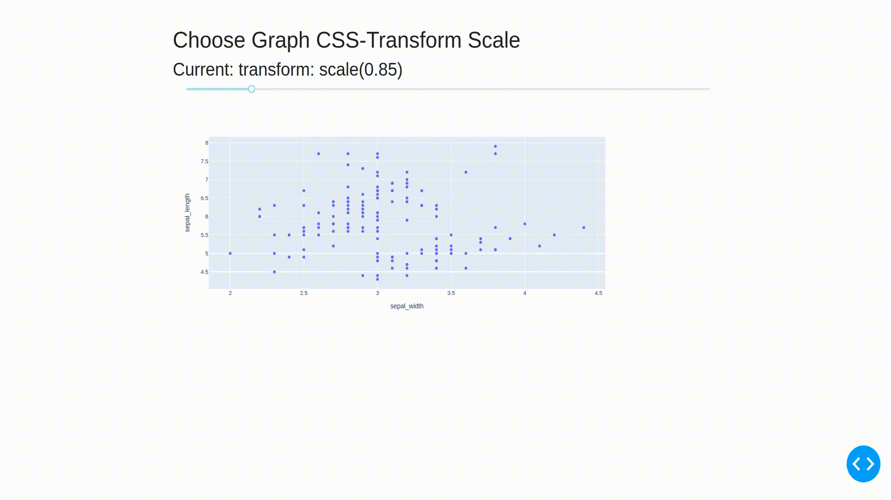
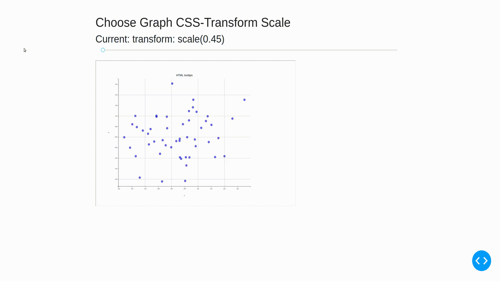

# dash-graphs-css-transform
Repository with sample code of graphs usage in CSS-transformed layout of Dash app.

# Use case
In current version of [Dash](https://github.com/plotly/dash), interactive Plotly-based charts [do not render properly on page layout that is transformed with CSS](https://github.com/plotly/plotly.js/issues/888). 
While click/drag events seem to work correctly, the rendering of hover information is offset. Right now, solving this bug requires a **$10-$15k sponsorship**.

This repository aims to show a workaround for this problem - with changing main charting library rather than paying developers a small fortune ;).

# Problem example

# Solution
Workaround requires switching from native [Plotly](https://github.com/plotly/plotly.py) charting library to [mpld3](https://mpld3.github.io/index.html). This framework translates [Matplotlib](http://www.matplotlib.org/) charts to interactive web applications with usage of [D3.js](http://d3js.org/).

# Solution example

# Evaluation
As our solution solves the initial problem, unfortunately its' success depends highly on your use case:
* it is still a library change - which you can't afford if you are strictly bound to Plotly framework in your Dash app project,
* not all features work in mpld3 - [there is a list of missing ones](https://github.com/mpld3/mpld3/wiki),
* some chart elements quite hard to change (e.g. grid lines color, axes custom font). But don't be worried - with a *smart/hacky* approach to raw mpld3 code itself, as well as Dash app, they can be fixed ;).

# Usage
Simply run `python3 app.py` while being in the repository folder.